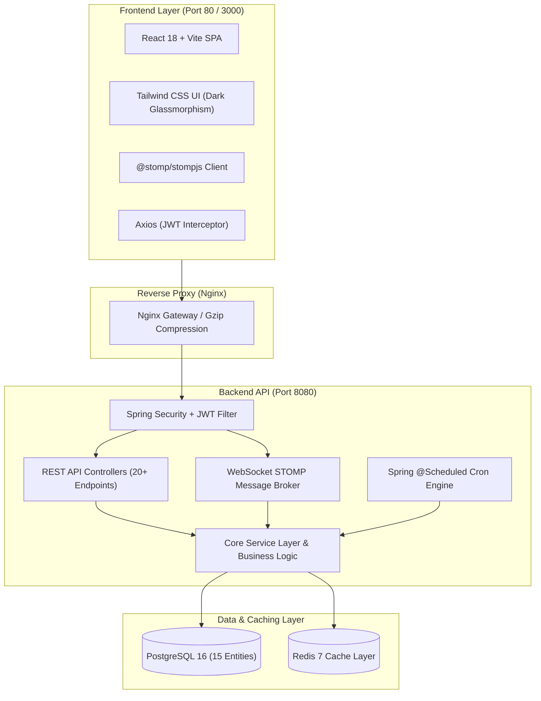

# 📦 BorrowBox

<div align="center">

> *"Borrow what you need. Share what you have."*

[](https://adoptium.net/)
[](https://spring.io/projects/spring-boot)
[](https://react.dev/)
[](https://www.typescriptlang.org/)
[](https://vitejs.dev/)
[](https://tailwindcss.com/)
[](https://www.postgresql.org/)
[](https://redis.io/)
[](https://www.docker.com/)
[](LICENSE)

**BorrowBox** is a modern, peer-to-peer neighborhood gear-sharing and lending platform that empowers communities to temporarily borrow high-value equipment—such as power tools, cameras, camping gear, and audiovisual systems—safely and cost-effectively.

[Explore Features](#-key-features) • [System Architecture](#-system-architecture) • [Quick Start](#-quick-start) • [Demo Accounts](#-demo-accounts) • [API Catalog](#-rest--websocket-api-catalog)

</div>

---

## 🌟 Key Features

### 🔍 1. Discovery & Search Engine
- **Full-Text & Multi-Criteria Filtering**: Filter by keyword, category, condition (`NEW`, `LIKE_NEW`, `GOOD`, `FAIR`, `USED`), daily price slider, neighborhood locality, and lending mode (`FREE`, `DAILY_RATE`, `DEPOSIT_ONLY`, `RATE_AND_DEPOSIT`).
- **Dynamic JPA Criteria Builder**: Optimized database query planner with pagination and multi-sort criteria (`newest`, `popularity`, `price`).

### 📅 2. Deterministic Availability Calendar
- **Interactive Range Picker**: Visual date picker highlighting confirmed bookings in red and available windows in emerald.
- **Overlap Prevention Algorithm**: Backend JPA boundary check ensures zero double-booking overlaps (`startDate <= existingEnd AND endDate >= existingStart`).

### 🛡️ 3. 6-Digit OTP Handover Verification
- **Dual-Phase Verification**: Unique cryptographically secure 6-digit OTP codes for both **Pickup Handover** and **Return Handover**.
- **Interactive QR Code Integration**: Borrowers can display dynamic QR codes for instant optical scan verification.
- **Pre- & Post-Condition Photo Logging**: Capture timestamped gear condition photos before pickup and after return to resolve claims objectively.

### ⚖️ 4. 4-Dimensional Weighted Reputation System
- **Formula-Driven Trust Score**: Starts at 80.0 points and transparently recomputes on every transaction lifecycle event.
- **Multi-Factor Breakdown**:
  $$\text{Reputation} = w_1 \cdot \text{Rating} + w_2 \cdot \text{Completed Lendings} + w_3 \cdot \text{Completed Borrows} - w_4 \cdot \text{Cancellations} - w_5 \cdot \text{Penalties}$$
- **4D Ratings**: Rate lending partners across **Overall**, **Communication**, **Punctuality**, and **Condition / Reliability**.

### 💬 5. Real-Time WebSocket Messaging
- **STOMP over SockJS**: Instant, low-latency direct messaging between borrowers and owners with unread count tracking and typing indicators.

### ⏱️ 6. Automated Background Scheduled Jobs
- **Hourly Overdue Sweeper**: Auto-detects transactions past return deadlines, marks them `OVERDUE`, applies reputation penalties, and fires urgent alerts.
- **Daily 8:00 AM Return Reminders**: Sends proactive preparation notifications 24 hours prior to scheduled return times.
- **Stale Request Expiration**: Automatically cancels unreviewed pending borrow requests whose start date has elapsed.

### 📊 7. Comprehensive Admin Operations Console
- **KPI Metrics & Financials**: Monitor active listings, total rental volume, escrow balances, and category inventory distributions.
- **Dispute Arbitration Engine**: Formal dispute workflows allowing admins to refund escrow, penalize at-fault accounts, or dismiss claims.
- **User & Content Moderation**: Instant toggling of user bans, ID verification badges, and item visibility.

---

## 🏛 System Architecture



---

## 🚀 Quick Start

### Option A: Docker Compose (Recommended)

Run the entire full-stack application (PostgreSQL, Redis, Spring Boot backend, and Nginx frontend) with one command:

```bash
# Clone the repository
git clone https://github.com/Kaviyarasu-S-Coder/BorrowBox.git
cd BorrowBox

# Launch all containerized services
docker-compose up -d --build
```

Once running, access:
- **Frontend Web Application**: [http://localhost](http://localhost) (or [http://localhost:3000](http://localhost:3000))
- **Backend REST API**: [http://localhost:8080/api](http://localhost:8080/api)
- **Swagger / OpenAPI 3.0 Docs**: [http://localhost:8080/swagger-ui/index.html](http://localhost:8080/swagger-ui/index.html)

---

### Option B: Local Development Setup

#### Prerequisites
- **Java 21 JDK**
- **Apache Maven 3.9+**
- **Node.js 20+**
- **PostgreSQL 16** & **Redis 7** (or run with embedded dev profile)

#### 1. Start Backend
```bash
cd backend
mvn clean spring-boot:run
```
*Backend runs on `http://localhost:8080` with H2/PostgreSQL and seeds 12 items & demo accounts automatically.*

#### 2. Start Frontend
```bash
cd frontend
npm install
npm run dev
```
*Frontend runs on `http://localhost:5173` with Vite HMR.*

---

## 🔑 Demo Accounts

The database comes pre-seeded with realistic demo personas for immediate end-to-end evaluation:

| Role | Email | Password | Details |
| :--- | :--- | :--- | :--- |
| **Admin** | `admin@borrowbox.com` | `AdminPass123!` | Full platform administration, moderation, and ops triggers. |
| **Power Lender** | `sarah@borrowbox.test` | `Password123!` | Rep: 96.0. Owns Sony A7 III, DeWalt Hammer Drill, DJI Drone. |
| **Borrower / DIYer** | `alex@borrowbox.test` | `Password123!` | Rep: 90.0. Active bookings, Kärcher Pressure Washer, Saw. |
| **Camper / Outdoor** | `priya@borrowbox.test` | `Password123!` | Rep: 94.0. Owns Coleman 4-Person Waterproof Tent, Down Bag. |
| **Sound / AV Tech** | `david@borrowbox.test` | `Password123!` | Rep: 86.0. Owns Epson Laser Projector, Bose S1 PA Speaker. |

---

## 📚 REST & WebSocket API Catalog

### 🔐 Authentication & Profile (`/api/auth`, `/api/users`)
- `POST /api/auth/register` — Create new user account with initial 80.0 reputation score.
- `POST /api/auth/login` — Authenticate and receive JWT access & refresh tokens.
- `POST /api/auth/refresh` — Issue fresh access token from valid refresh token.
- `GET /api/users/me` — Retrieve authenticated user profile, statistics, and badges.
- `PUT /api/users/me` — Update biography, location, and contact details.

### 📦 Item Listings & Discovery (`/api/items`, `/api/categories`)
- `GET /api/categories` — Fetch all root categories with subcategory hierarchies.
- `GET /api/items` — Multi-filter search (keyword, category, condition, mode, price, location).
- `GET /api/items/{id}` — Fetch detailed item specifications, owner profile, and review summary.
- `POST /api/items` — List new gear with multi-image URLs and borrowing rules.
- `PUT /api/items/{id}` — Modify item details or update active/maintenance status.
- `GET /api/items/{id}/availability/check` — Check date-range availability and calculate costs.

### 🤝 Borrowing & Transaction Lifecycle (`/api/borrow-requests`, `/api/transactions`)
- `POST /api/borrow-requests` — Submit a borrow booking request with purpose and message.
- `GET /api/borrow-requests/my-requests` — Retrieve all requests submitted by current user.
- `GET /api/borrow-requests/my-lendings` — Retrieve inbound booking requests for current owner.
- `PUT /api/borrow-requests/{id}/accept` — Owner approves request and initializes transaction.
- `PUT /api/borrow-requests/{id}/reject` — Owner declines request with reason.
- `POST /api/transactions/{id}/confirm-pickup` — Owner inputs borrower's 6-digit pickup OTP.
- `POST /api/transactions/{id}/confirm-return` — Owner inputs borrower's 6-digit return OTP.
- `POST /api/transactions/{id}/condition` — Record pre-pickup or post-return inspection condition.

### ⭐ Community Trust & Moderation (`/api/ratings`, `/api/disputes`, `/api/reports`)
- `POST /api/ratings` — Submit 4-dimensional weighted review for completed transaction.
- `GET /api/ratings/user/{userId}` — Retrieve verified reviews received by a user.
- `POST /api/disputes` — Raise formal transaction dispute with evidence.
- `POST /api/reports` — Report inappropriate content or suspected fraud.

### 🛡️ Admin Operations (`/api/admin`)
- `GET /api/admin/dashboard/stats` — Platform KPI metrics, inventory counts, and financial escrow.
- `GET /api/admin/users` — Moderate users, toggle active status, and assign verification badges.
- `GET /api/admin/disputes` — Review and arbitrate open disputes with deposit refunds/penalties.
- `POST /api/admin/jobs/trigger-overdue` — Manually trigger scheduled overdue scanner.

---

## 🧪 Testing Suite

BorrowBox includes a 100% passing test suite with **29 automated integration and E2E tests**:

```bash
# Run backend test suite
cd backend
mvn clean test
```

### Key Integration Tests:
- `BorrowBoxEndToEndFlowTest`: Complete lifecycle test covering registration, listing, calendar check, OTP pickup verification, return verification, 4D ratings, and reputation recalculation.
- `AvailabilityControllerTest`: Overlap prevention and date-boundary conflict engine tests.
- `DisputeAndReportControllerTest`: Dispute arbitration and moderation sanction test suites.
- `ScheduledJobTest`: Background cron overdue sweeper and reminder dispatcher tests.
- `AdminDashboardControllerTest`: Admin metrics aggregation and user status toggle tests.

---

## 📄 License

This project is open-source and distributed under the [MIT License](LICENSE).
