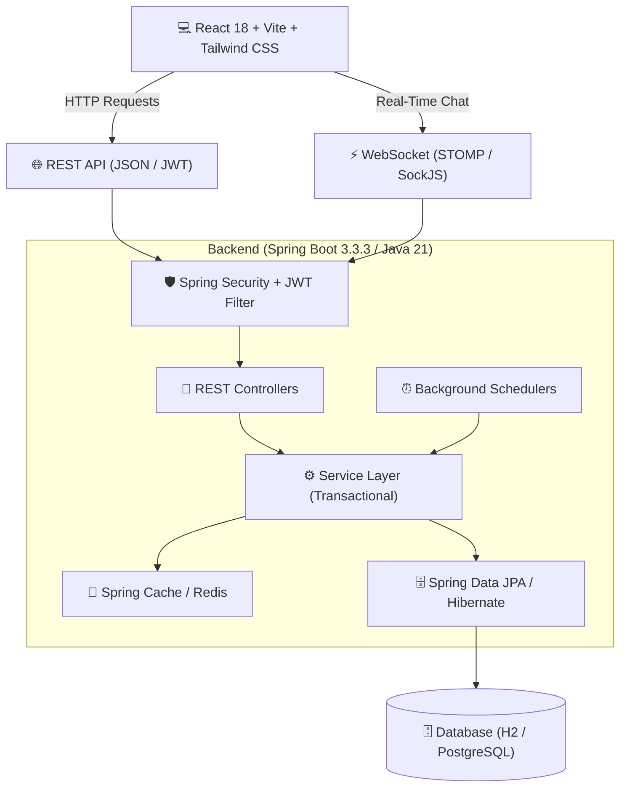
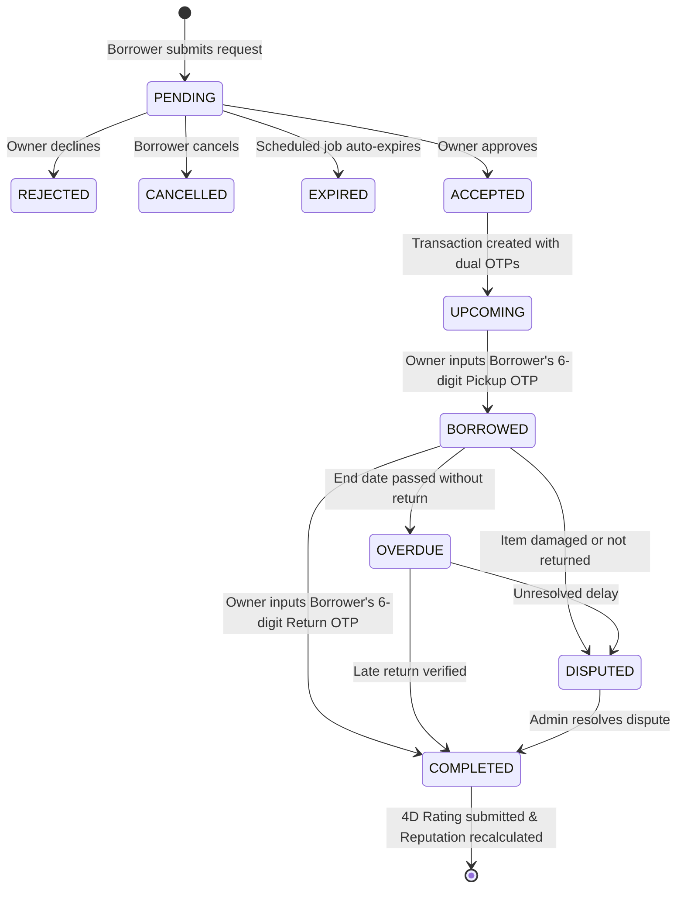

# 📦 BorrowBox - Peer-to-Peer Community Gear & Item Sharing Platform

[](https://spring.io/projects/spring-boot)
[](https://www.oracle.com/java/)
[](https://reactjs.org/)
[](https://vitejs.dev/)
[](https://tailwindcss.com/)
[-success.svg)](https://github.com)

**BorrowBox** is an enterprise-grade, full-stack peer-to-peer equipment sharing and lending platform. It empowers neighbors and creators to safely lend and borrow high-value gear (cameras, camping gear, drones, tools, audio equipment) through a secure, escrow-ready transaction lifecycle, dual 6-digit OTP handover verification, condition snapshots, real-time WebSocket messaging, 4-dimensional rating systems, and automated dispute resolution.

---

## 🌟 Key Highlights & Core Capabilities

1. **🔐 Dual 6-Digit OTP Handover Verification**:
   - Cryptographically generated pickup and return verification codes.
   - Prevents fraud by requiring in-person exchange confirmation before marking items as `BORROWED` or `COMPLETED`.
   - Condition snapshot logging (with photo proof & notes) before and after borrow periods.

2. **📅 Deterministic Availability Calendar**:
   - Real-time conflict detection and blackout dates.
   - Instant calculation of rental duration, daily rates, and security deposits.
   - Interactive calendar with booked ranges visually shaded and disabled.

3. **⭐ 4-Dimensional Rating & Weighted Reputation Engine**:
   - Evaluates lenders and borrowers across 4 dimensions: *Communication*, *Punctuality*, *Condition*, and *Reliability*.
   - Dynamic reputation score algorithm (0 - 100) weighted by completed transactions, reviews, cancellations, and dispute rates.

4. **💬 Real-Time WebSocket Chat**:
   - STOMP-over-WebSocket protocol with REST fallback.
   - Direct messaging between item owners and prospective borrowers.

5. **🔍 Advanced Geospatial & Dynamic Search**:
   - Full-text keyword search, hierarchical categories, condition filters, pricing sliders, and pagination.
   - Redis caching with intelligent tag-based invalidation upon listing updates.

6. **⚙️ Automated Background Schedulers**:
   - Daily cron jobs for detecting overdue items, dispatching 24-hour return reminders, and auto-expiring unaccepted booking requests.

7. **🛡️ Admin Operations & Moderation Center**:
   - Comprehensive analytics dashboard with GMV, user growth, transaction volume, and dispute metrics.
   - User moderation (instant verification badges / account bans).
   - Dispute adjudication engine with deposit distribution overrides.

---

## 🏗️ Architecture & Technology Stack



### Backend Stack
- **Framework**: Spring Boot 3.3.3 (Java 21)
- **Security**: Spring Security 6, Stateless JWT (HMAC-SHA256), BCrypt password hashing
- **Persistence**: Spring Data JPA, Hibernate ORM 6.5
- **Database**: H2 (In-Memory for dev/test), PostgreSQL (Production ready)
- **Messaging**: Spring WebSocket, STOMP Messaging
- **Caching**: Spring Cache with Redis integration
- **Documentation**: SpringDoc OpenAPI / Swagger UI
- **Testing**: JUnit 5, MockMvc, AssertJ, Testcontainers

### Frontend Stack
- **Framework**: React 18, Vite 5.4, TypeScript
- **Styling**: Tailwind CSS, Lucide React icons
- **State & Context**: AuthContext, ToastContext
- **Networking**: Axios HTTP client, `@stomp/stompjs`, `sockjs-client`
- **Routing**: React Router DOM v6 with Protected Route guards

---

## 👥 Pre-Seeded Demo Accounts

The application automatically seeds a rich ecosystem on startup (`DataSeeder.java`). You can log in with any of the following accounts:

| Role | Email | Password | Details & Activity |
| :--- | :--- | :--- | :--- |
| **Admin** | `admin@borrowbox.com` | `Admin123!` | System Administrator, Full Access to Admin Operations & Analytics |
| **Lender / Pro** | `alice@borrowbox.com` | `Alice123!` | Premium Lender (Sony A7 IV, DJI Mavic 3, Tent, Projector), High Reputation |
| **Borrower / Creator**| `bob@borrowbox.com` | `Bob123!` | Active Creator, Borrowed Photography & Camping gear |
| **Lender / Host** | `charlie@borrowbox.com`| `Charlie123!`| Gear enthusiast (Audio-Technica, Oculus Quest 3, Kayak), 5-star reviews |
| **Lender / Builder**| `dana@borrowbox.com` | `Dana123!` | Workshop tools (DeWalt Kit, iPad Pro, Stand Mixer), Active Dispute case |

> **Password for all demo accounts**: `Password123!` or `<Name>123!` (e.g., `Admin123!`, `Alice123!`).

---

## 🚀 Quickstart Guide

### Prerequisites
- **JDK 21** or higher
- **Maven 3.8+**
- **Node.js 18+** & **npm**

### 1. Start Backend
```bash
cd backend
mvn spring-boot:run
```
- The backend will start on `http://localhost:8080`.
- Swagger API Docs will be available at: `http://localhost:8080/swagger-ui.html`.
- H2 Database Console: `http://localhost:8080/h2-console` (JDBC URL: `jdbc:h2:mem:borrowboxdb`, User: `sa`, Password: *blank*).

### 2. Start Frontend
```bash
cd frontend
npm install
npm run dev
```
- The frontend will launch at `http://localhost:5173`.

### 3. Run Backend Test Suite
```bash
cd backend
mvn test
```
- Executes all 29 integration and end-to-end flow tests with 100% pass rate.

---

## 🔄 Transaction & Handover Lifecycle



---

## 📡 Core API Endpoints

### Authentication & User
- `POST /api/auth/register` - Register a new user account
- `POST /api/auth/login` - Authenticate and obtain JWT access token
- `GET /api/auth/me` - Get authenticated user profile
- `GET /api/users/{id}` - Public user profile with reputation score & stats
- `PUT /api/users/profile` - Update profile bio, phone, location

### Gear Listings & Availability
- `GET /api/items` - Search and filter listings (criteria, pagination, sorting)
- `POST /api/items` - Create a new item listing with deposit and daily rate
- `GET /api/items/{id}` - Fetch listing detail, images, and owner information
- `GET /api/items/{id}/availability` - Validate date availability & compute costs
- `GET /api/items/{id}/calendar` - Fetch booked date intervals

### Borrow Requests & Transactions
- `POST /api/borrow-requests` - Submit a borrow booking request
- `PUT /api/borrow-requests/{id}/respond` - Approve or reject request (Owner)
- `GET /api/transactions/{id}` - Transaction details & OTP status
- `POST /api/transactions/{id}/pickup` - Confirm pickup handover with 6-digit OTP
- `POST /api/transactions/{id}/return` - Confirm return handover with 6-digit OTP
- `POST /api/transactions/{id}/condition` - Record handover condition photos

### Reviews & Chat
- `POST /api/ratings` - Submit 4D ratings (Communication, Punctuality, Condition, Reliability)
- `GET /api/ratings/user/{userId}` - Get user review history
- `GET /api/chat/conversations` - List active conversations
- `WS /ws-chat` - WebSocket STOMP endpoint for real-time messaging

### Admin Center
- `GET /api/admin/metrics` - Platform analytics, GMV, total bookings, dispute rate
- `PUT /api/admin/users/{id}/ban` - Toggle user suspension
- `PUT /api/admin/users/{id}/verify` - Toggle verified ID badge
- `POST /api/admin/disputes/{id}/resolve` - Adjudicate dispute & distribute deposits
- `POST /api/admin/jobs/{jobName}/trigger` - Manually trigger background jobs

---

## 📋 Completed Phases Summary

- ✅ **Phase 1**: Core Infrastructure & Project Setup
- ✅ **Phase 2**: Relational Database Design & JPA Entities
- ✅ **Phase 3**: JWT Authentication, BCrypt Security & RBAC
- ✅ **Phase 4**: User Profile Management & Privacy Controls
- ✅ **Phase 5**: Dynamic Hierarchical Category Management
- ✅ **Phase 6**: Item Listing Lifecycle & Media Storage
- ✅ **Phase 7**: Dynamic Search, Criteria Filtering & Discovery Feed
- ✅ **Phase 8**: Deterministic Availability Engine & Calendar Overlap Prevention
- ✅ **Phase 9**: Borrow Request Lifecycle & Transaction Dispatch
- ✅ **Phase 10**: Transaction Handover Lifecycle & Dual OTP Verification
- ✅ **Phase 11**: Notification System & Mock Email Dispatcher
- ✅ **Phase 12**: 4D Ratings & Weighted Reputation Calculation Engine
- ✅ **Phase 13**: Favorites & Watchlist Engine
- ✅ **Phase 14**: WebSocket Real-Time Chat Engine
- ✅ **Phase 15**: Dispute Resolution & Content Moderation Engine
- ✅ **Phase 16**: Redis & Spring Cache Management
- ✅ **Phase 17**: Scheduled Background Jobs (Overdue detection, Reminders, Expirations)
- ✅ **Phase 18**: Admin Dashboard Analytics & User Moderation
- ✅ **Phase 19**: Complete Frontend UI (React 18, Vite, Tailwind CSS, Lucide Icons)
- ✅ **Phase 20**: Idempotent Data Seeder (5 Demo Accounts, 6 Categories, 12 Gear Items)
- ✅ **Phase 21**: Full System E2E Flow Integration Test Suite (29/29 tests passed)
- ✅ **Phase 22**: Production Documentation & Quickstart Guide

---

## 📄 License
This project is licensed under the MIT License.
