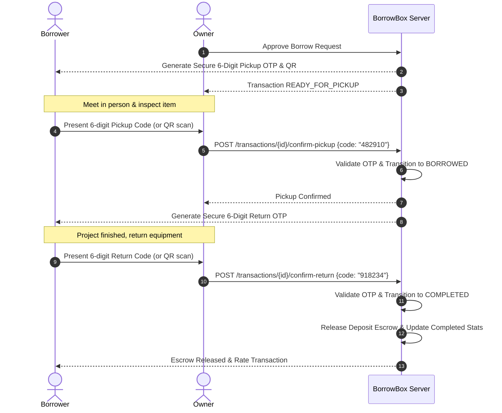

# 🏛 BorrowBox Deep Technical Architecture Reference

BorrowBox is engineered using a modular, domain-driven full-stack architecture prioritizing performance, data integrity, cryptographic trust verification, and real-time responsiveness.

---

## 1. Domain Entities & Database Schema

The database consists of 15 relational entities managed via JPA/Hibernate on PostgreSQL 16:

1. **`users`**: Multi-role users with embedded geographic coordinates, contact info, and formulaic reputation scores.
2. **`user_roles`**: ElementCollection maintaining RBAC authority sets (`ROLE_USER`, `ROLE_ADMIN`).
3. **`categories`**: Self-referencing hierarchical category tree supporting root categories and nested subcategories.
4. **`items`**: Equipment listings with condition, estimated value, daily rate, security deposit, lending mode, and optimistic locking (`@Version`).
5. **`item_images`**: Multi-image attachments with primary flag and display ordering.
6. **`borrow_requests`**: State-machine tracking booking proposals (`PENDING`, `ACCEPTED`, `REJECTED`, `CANCELLED`, `EXPIRED`).
7. **`borrow_transactions`**: Concrete borrowing contracts with cryptographically generated 6-digit OTP codes for pickup and return handovers.
8. **`transaction_conditions`**: Visual audit trail capturing pre-pickup and post-return gear condition notes and photo URLs.
9. **`ratings`**: 4-Dimensional reputation reviews (`overallRating`, `communicationRating`, `punctualityRating`, `reliabilityRating`, `conditionRating`).
10. **`favorites`**: User watchlist linking users to bookmarked items with uniqueness constraints.
11. **`conversations`**: Direct messaging channel linking two participants, optionally pinned to a borrow transaction.
12. **`messages`**: Chat messages delivered over WebSocket STOMP and persisted with delivery/read timestamps.
13. **`notifications`**: Polymorphic in-app alert entities with deep-link routing.
14. **`disputes`**: Formal arbitration claims with administrative ruling, financial escrow release, and reputation penalty outcomes.
15. **`reports`**: Community content moderation flags with administrative sanctions.

---

## 2. Cryptographic Handover & Security Model

---

## 3. Caching & Performance Subsystem

- **Spring Cache Layer**: Dual-mode cache configuration supporting in-memory `ConcurrentMapCacheManager` for lightweight development and `RedisCacheManager` with custom TTL policies in production:
  - `categories`: 24h TTL (rarely mutated, evicted on category update)
  - `popular_items`: 15m TTL (recomputed periodically)
  - `item_availability`: 5m TTL (evicted on transaction creation/confirmation)

---

## 4. Background Job Automation

- `@Scheduled` Workers running background tasks:
  - **Hourly Overdue Sweeper**: Detects active loans past return dates, applies immediate status transitions to `OVERDUE`, deducts -5 reputation points, and dispatches SMS/Email alerts.
  - **Daily 8:00 AM Reminder Job**: Scans for bookings expiring the next calendar day, sending 24-hour return notifications.
  - **Stale Request Cleaner**: Cancels requests where start date has passed without owner action.
